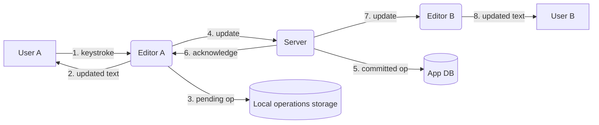

```mermaid
flowchart LR
  UserA[User A]
  UserB[User B]

  EditorA("Editor A")
  SyncService("Server")
  EditorB("Editor B")

  IndexedDB[("Local operations storage")]
  AppDB[("App DB")]

  UserA -->|1. keystroke| EditorA
  EditorA -->|2. updated text| UserA
  EditorA -->|3. pending op| IndexedDB 
  EditorA -->|4. update| SyncService
  SyncService -->|5. committed op| AppDB
  SyncService -->|6. acknowledge| EditorA
  SyncService -->|7. update| EditorB
  EditorB -->|8. updated text| UserB
```